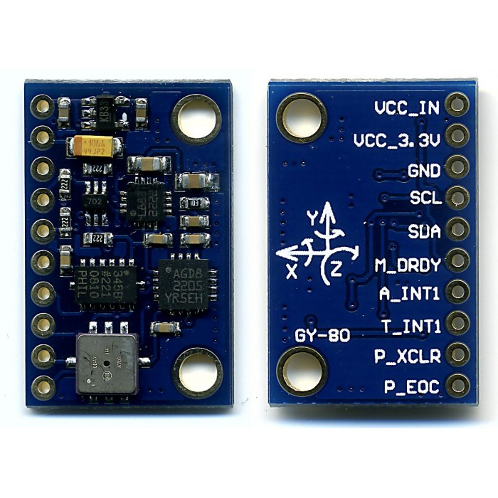

# django_mysite
My first Django application

In this example, I built a web application called "xyz". 
When accessed through a web browser, it communicates with an Arduino device, saves the query results to a database, and displays the most recent 5 saved results.

## Latest Records
| X	    | Y	    |  Z	    | Date                 |
|-------|-------|-----------|----------------------|
| 10.4	| 0.08	|  -1.57	| 2024-04-09 09:16:40  |
| 10.47	| 0.08	|  -1.53	| 2024-04-09 09:06:58  |
| 10.47	| 0.08	|  -1.53	| 2024-04-09 09:01:10  |
| 10.43	| 0.0	|  -1.53	| 2024-04-09 09:00:53  |
|  3.45	| 0.08	| -10.59	| 2024-04-09 09:00:42  |

